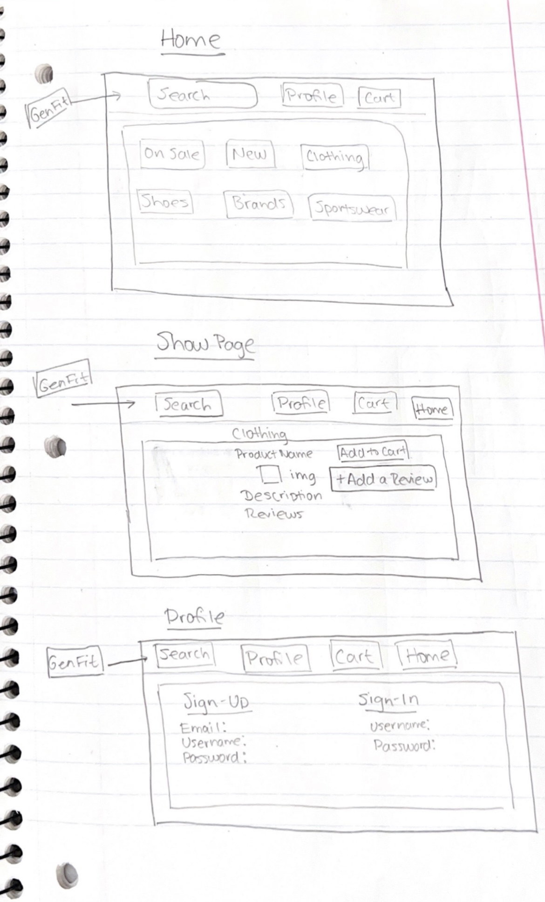
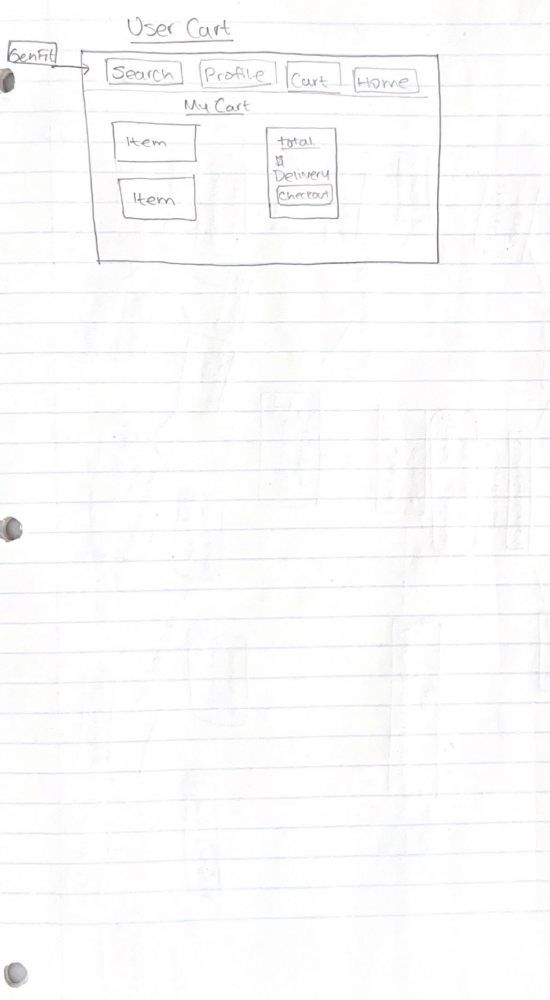

# GenFit

## Description 
Reverse engineering of a  shopping website that can be a destination for people who are looking for a wide range of gender neutral styles. 

## MVP Goals
* On display home page:
  *  Navigation bar with search and profile
  *  Go to categories when icon is clicked.
  *  Categories for sale, new, clothes, shoes, accessories.
  *  Go to profile when clicked
  *  Search by type

* On Show page:
  * When clicked on particular product to show  its type, description, price, reviews, and the ability to leave a review.
* On Profile page:
  * user name
  * picture
 

## User Stories

* As a user, I want to see Main page with different sections: New, Sale, Clothes(Tops, Bottoms), Shoes, Accessories.
* As a user I want to have the ability to add or remove selected items from the basket.
* As a user I want to have ability to buy from my basket cart
* As a user I want  to be able to leave review comments
* As a user I want to see a price.

## Wireframes

## Workflow
* Tim: Views, CSS, Config, Models/Schema
* Zarema: Show, Controllers, Archive, Routes

## Model & Association

## Stretch Goals

* Shopping cart that displays items users added to the cart with a price total and checkout option

* Display user profile page with user authetication

* Slideshow of outfits on a homepage 

* Website and mobile versions
